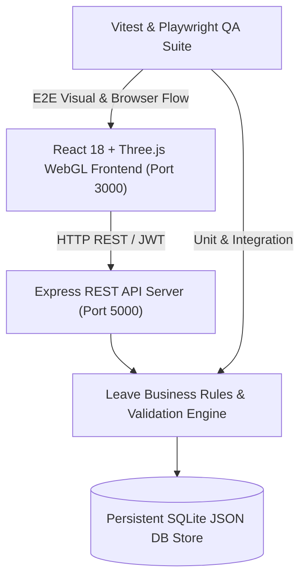
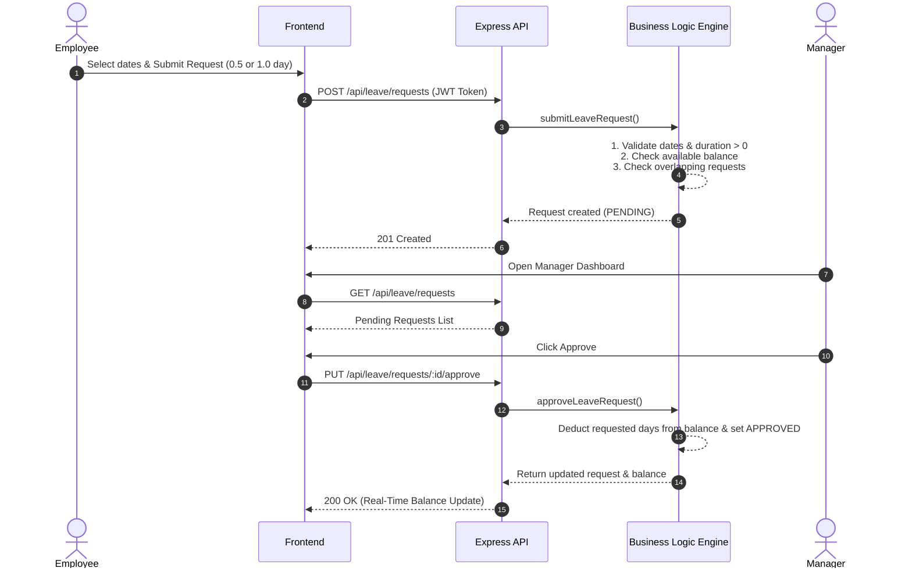

# LeaveFlow — System Architecture & Engineering Specifications

## 1. System Overview
LeaveFlow is a high-performance Leave Approval Management System engineered for enterprise transparency, strict business rule enforcement, zero-configuration local deployment, and visual excellence.

---

## 2. Component Architecture

### Frontend Layer (`frontend/`)
- **React 18 + Vite**: Lightning-fast HMR and modular component rendering.
- **Three.js WebGL Centerpiece (`Hero3D.jsx`)**: Glassmorphism translucent 3D approval card with physical lighting, soft shadows, metallic orbits, and mouse-follow parallax animation.
- **State & Auth Context (`AuthContext.jsx`)**: Token storage in `localStorage`, role-based route protection, session revalidation.
- **Components**:
  - `Navbar.jsx`: Brand logo, navigation links, role badges, quick login triggers.
  - `LandingPage.jsx`: Hero, feature metrics grid, workflow timeline, business rules matrix.
  - `EmployeeDashboard.jsx`: Real-time leave balances (Annual, Casual, Sick), request history table, status badges.
  - `ManagerDashboard.jsx`: Pending approval queue, team balance directory, rejection modal trigger, approval log.
  - `LeaveRequestModal.jsx`: Leave category picker, date range picker, duration mode (Full Day, First Half, Second Half), reason input, real-time day calculation preview.
  - `RejectionModal.jsx`: Enforces mandatory rejection reason string input.

### Backend REST API Layer (`backend/`)
- **Express.js Server (`server.js`)**: Clean modular REST endpoints:
  - `POST /api/auth/login`: User authentication with JWT signing.
  - `GET /api/auth/me`: Current session revalidation.
  - `GET /api/leave/balances`: Logged-in user balances.
  - `GET /api/leave/requests`: Requests array (filtered by employee ID for employees; all requests for managers).
  - `POST /api/leave/requests`: Leave submission with full validation engine check.
  - `PUT /api/leave/requests/:id/approve`: Manager approval route.
  - `PUT /api/leave/requests/:id/reject`: Manager rejection route with mandatory reason.
  - `POST /api/test/red-run-toggle` & `POST /api/test/reset-db`: Test harness control endpoints.

### Business Rules & Validation Engine (`backend/src/services/leaveService.js`)
- Enforces all 14 business rules server-side.
- Manages half-day duration math (0.5 days vs 1.0 day).
- Manages date range overlap checks with half-day granularity.
- Supports `DELIBERATE_RED_RUN_BUG` toggle for assessment QA verification.

---

## 3. Data & Authentication Flow

---

## 4. Technology Selection Rationale
1. **Node.js + Express**: Lightweight, zero external platform dependencies, simple single-command startup.
2. **Persistent File DB**: Guarantees instant zero-compilation startup on any operating system without C++ toolchain dependencies.
3. **Three.js**: Lightweight 3D canvas rendering without heavy asset loading or UI performance overhead.
4. **Vitest + Playwright**: Modern, fast test runners supporting unit, API integration, and E2E browser automation.
