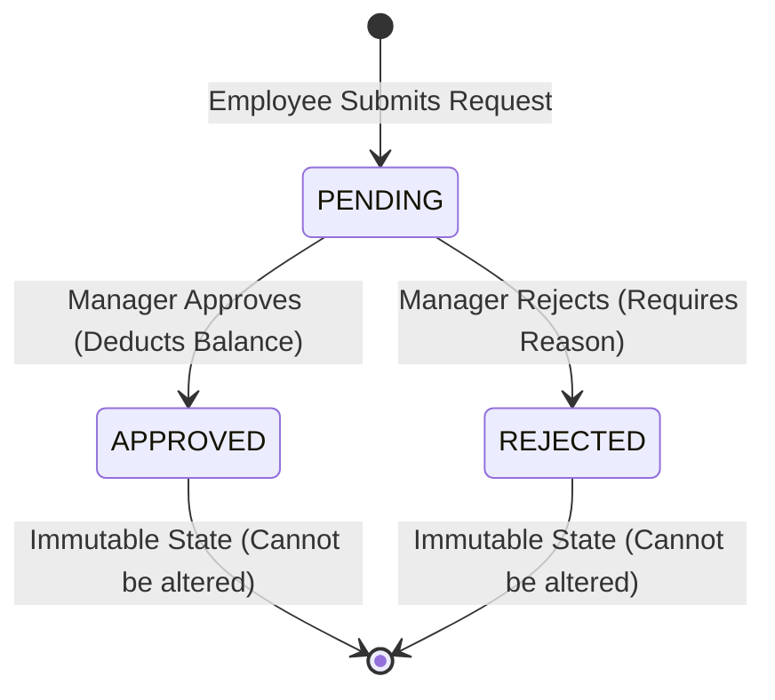

# LeaveFlow — Design Specifications & Data Model

## 1. Entity Data Model

### User Entity
```json
{
  "id": "usr_emp1",
  "email": "employee@leaveflow.com",
  "name": "Sarah Jenkins",
  "role": "EMPLOYEE", // 'EMPLOYEE' | 'MANAGER'
  "department": "Engineering",
  "avatar": "https://...",
  "balances": {
    "ANNUAL": { "total": 15, "used": 3, "available": 12 },
    "CASUAL": { "total": 10, "used": 4, "available": 6 },
    "SICK": { "total": 10, "used": 2, "available": 8 }
  }
}
```

### Leave Request Entity
```json
{
  "id": "req_101",
  "userId": "usr_emp1",
  "userName": "Sarah Jenkins",
  "userEmail": "employee@leaveflow.com",
  "leaveType": "ANNUAL", // 'ANNUAL' | 'CASUAL' | 'SICK'
  "startDate": "2026-09-01",
  "endDate": "2026-09-03",
  "durationType": "FULL_DAY", // 'FULL_DAY' | 'FIRST_HALF' | 'SECOND_HALF'
  "daysCount": 3.0,
  "reason": "Attending tech conference",
  "status": "APPROVED", // 'PENDING' | 'APPROVED' | 'REJECTED'
  "rejectionReason": null,
  "reviewedBy": "Marcus Vance",
  "reviewedAt": "2026-08-10T10:00:00.000Z",
  "createdAt": "2026-08-09T14:30:00.000Z"
}
```

---

## 2. Request State Machine



---

## 3. Business Rule Matrix

| Rule ID | Rule Description | Enforced Layer | Error Message / Action |
| :--- | :--- | :--- | :--- |
| **BR-01** | Start date $\le$ End date | Frontend & Backend | `Start date cannot be after end date.` |
| **BR-02** | Duration $> 0$ | Backend | `Leave duration must be greater than zero.` |
| **BR-03** | Request $\le$ Available Balance | Frontend & Backend | `Insufficient [TYPE] leave balance.` |
| **BR-04** | Date Overlap Prevention | Backend Engine | `Overlapping leave request detected...` |
| **BR-05** | Half-Day Granularity | Backend Engine | `FIRST_HALF` and `SECOND_HALF` on same date allowed; conflicting halves rejected. |
| **BR-06** | Only PENDING can be Approved | Backend Engine | `Cannot approve: Request is already [STATUS].` |
| **BR-07** | Only PENDING can be Rejected | Backend Engine | `Cannot reject: Request is already [STATUS].` |
| **BR-08** | Balance Deduction | Backend Engine | Deducts `daysCount` from `available` on approval. |
| **BR-09** | Rejection Reason Mandatory | Frontend & Backend | `Rejection reason is mandatory when rejecting.` |
| **BR-10** | Manager Self-Approval Guard | Backend Engine | `Self-approval forbidden: Managers cannot approve own request.` |
| **BR-11** | Non-Manager Action Guard | Auth Middleware | `Unauthorized: Only managers can approve/reject.` |
| **BR-12** | Private Request Scope | API Router | Employees view only their own requests. |
